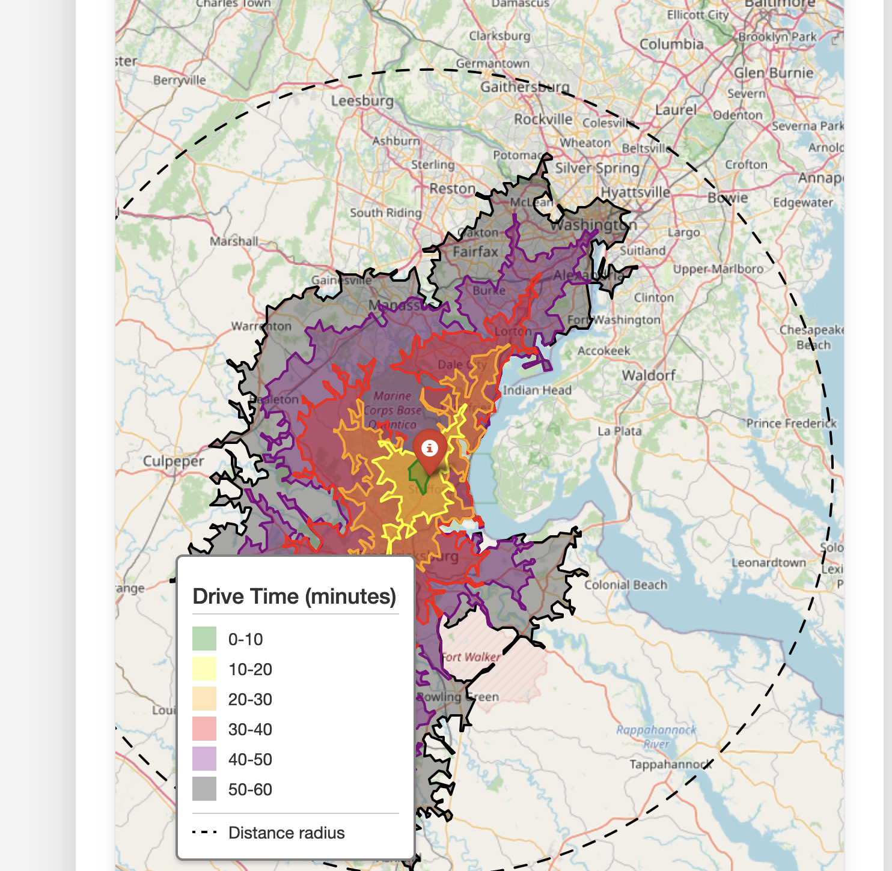

# Travel Time Map Generator

A Flask web application that generates interactive maps showing estimated travel times from a given location. Available in two versions:

1. **Basic Version** (`map-generator.py`): Uses simple circular rings to estimate travel times based on straight-line distance
2. **API Version** (`map-generator-apiheat.py`): Uses OpenRouteService API to calculate realistic drive times based on actual road networks



## Versions

### Basic Version (map-generator.py)
- Uses geometric circles to estimate travel times
- No API key required
- Simple distance-based calculations
- Faster execution
- Suitable for rough estimates and prototyping

### API Version (map-generator-apiheat.py)
- Uses OpenRouteService API for realistic drive times
- Requires API key
- Takes into account actual road networks
- More accurate results
- Subject to API rate limits

## Features

Common features in both versions:
- Generate travel time maps based on zip code or city/state
- Visualize estimated travel times from 10 to 60 minutes
- Color-coded zones for easy interpretation
- Interactive map with zoom and pan capabilities
- Mobile-responsive design

## Prerequisites

Basic Version:
- Python 3.7+
- Flask
- Folium
- Geopy

API Version (additional requirements):
- OpenRouteService API key (sign up at [openrouteservice.org](https://openrouteservice.org))
- Requests library

## Installation

1. Clone the repository:
```bash
git clone https://github.com/yourusername/travel-time-map-generator.git
cd travel-time-map-generator
```

2. Create a virtual environment and activate it:
```bash
python -m venv venv
source venv/bin/activate  # On Windows: venv\Scripts\activate
```

3. Install required packages:
```bash
pip install flask folium geopy requests
```

4. For API version only: Create a `config.py` file in the root directory and add your OpenRouteService API key:
```python
ORS_API_KEY = 'your-api-key-here'
```

## Usage

### Basic Version
1. Start the Flask development server:
```bash
python map-generator.py
```

### API Version
1. Start the Flask development server:
```bash
python map-generator-apiheat.py
```

For both versions:
2. Open a web browser and navigate to `http://localhost:5000`
3. Enter either:
   - A ZIP code, or
   - A city and state (e.g., "Stafford VA")
4. Enter the desired radius in miles
5. Click "Generate Map" to create the visualization

## Understanding the Visualization

- **Green Zone**: 0-10 minutes travel time
- **Yellow Zone**: 10-20 minutes travel time
- **Orange Zone**: 20-30 minutes travel time
- **Red Zone**: 30-40 minutes travel time
- **Purple Zone**: 40-50 minutes travel time
- **Black Zone**: 50-60 minutes travel time
- **Red Marker**: Selected location center point

## Technical Details

The application uses several key technologies:
- **Flask**: Web framework for the application
- **Folium**: Python library for creating interactive maps
- **Geopy**: Handles geocoding of addresses and ZIP codes
- **Tailwind CSS**: Styling for the web interface
- **OpenRouteService API** (API version only): Provides isochrone calculations

## API Rate Limits (API Version Only)

The free tier of OpenRouteService API has the following limits:
- 40 requests per minute
- 2000 requests per day

## Contributing

1. Fork the repository
2. Create a feature branch
3. Commit your changes
4. Push to the branch
5. Create a Pull Request

## License

This project is licensed under the MIT License - see the LICENSE file for details.

## Acknowledgments

- OpenStreetMap contributors for map data
- Folium developers for the mapping library
- OpenRouteService for providing the isochrone API (API version only)
